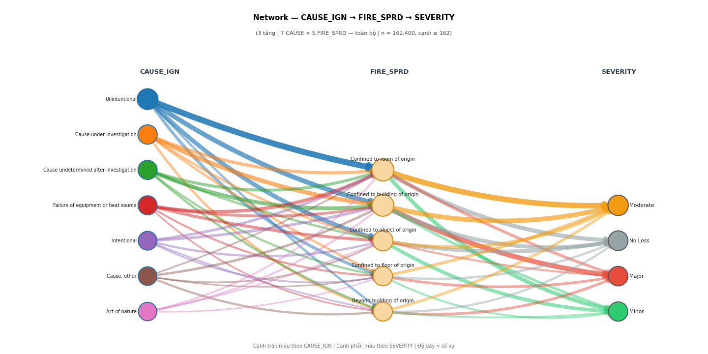
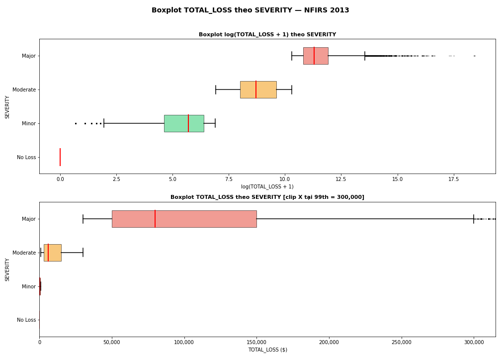
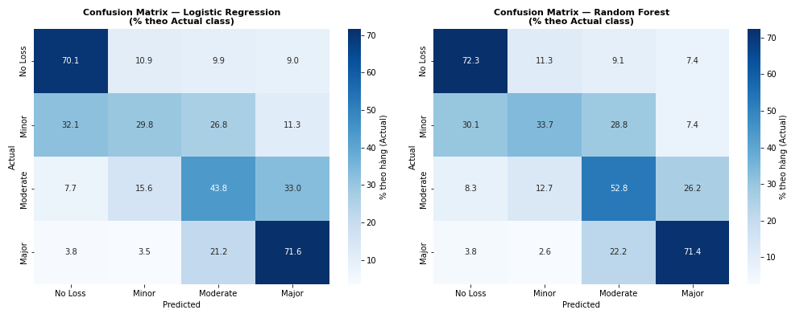
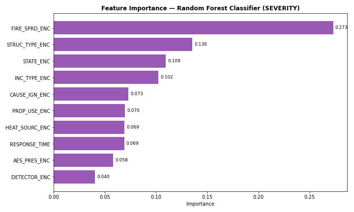
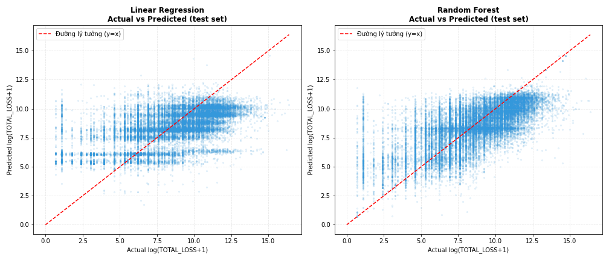
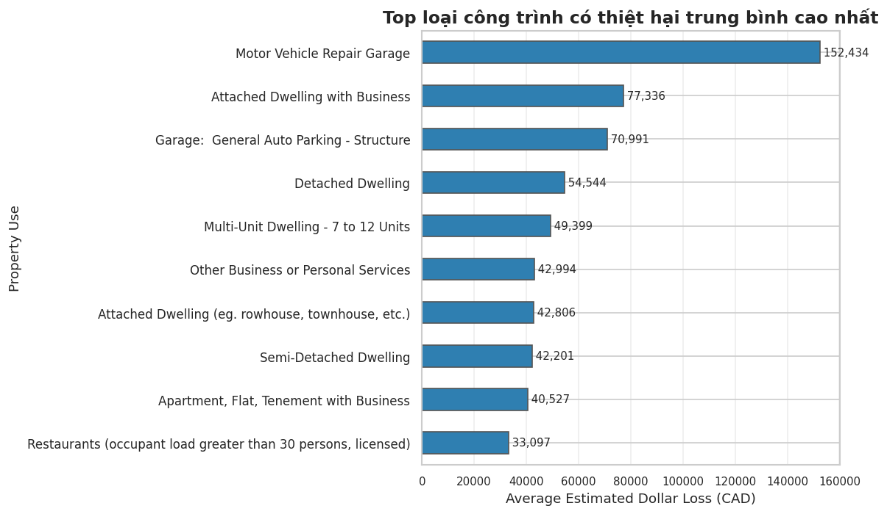
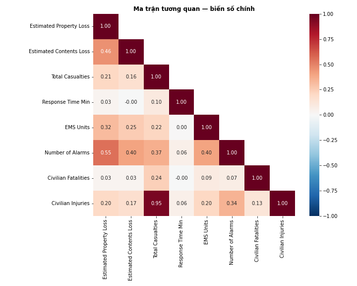

# Urban Fire Damage Prediction

Exploratory data analysis of three public urban fire datasets (San Francisco, Toronto and the US NFIRS 2013 national data) and machine learning models that estimate how much damage a fire causes: a classifier for damage severity and a regressor for dollar loss.

This is a course project for Introduction to Data Science at HCM-UTE (team of 3, June 2026). The full report is in Vietnamese: [Nhom01_BaoCao.pdf](Nhom01_BaoCao.pdf).



## Overview

- Each team member analysed one dataset in an Apache Zeppelin notebook: cleaning, missing value analysis, common statistics (mean, median, quartiles), moment statistics (skewness, kurtosis) and scoped statistics (the same statistics per group, such as per cause or per property type).
- The report compares the three datasets on size, data quality and how well they describe urban fires.
- On NFIRS 2013 we built a damage severity label from total loss and trained Logistic Regression and Random Forest classifiers, plus Linear Regression and Random Forest regressors for the dollar loss.
- The Toronto notebook repeats the same modelling on the Toronto data (not covered in the report).
- Both modelling notebooks end with a small form in Zeppelin where you pick the fire's attributes and get a prediction.

## Datasets

| Dataset | Source | Size | Analysed by |
|---|---|---|---|
| San Francisco Fire Incidents (2003 to May 2026) | [DataSF](https://data.sfgov.org/Public-Safety/Fire-Incidents/wr8u-xric/about_data) | 732,852 incidents, 66 columns; 43,799 urban fires (NFIRS codes 111 to 123) after filtering | Huỳnh Thanh Nhân |
| Toronto Fire Incidents (2011 to 2019) | [Kaggle, Reihane Namdari](https://www.kaggle.com/datasets/reihanenamdari/fire-incidents), from Toronto Fire Services | 11,214 fires, 27 columns | Trương Tấn Sang |
| NFIRS 2013 | [FEMA, US Fire Administration on data.world](https://data.world/fema/usfa-nfirs-2013-fire-incident) | 2,003,907 incidents in `basicincident`, joined with `fireincident` and a code lookup table; 462,631 urban fires (codes 111 to 123) after filtering | Huỳnh Ngọc Thắng |

The data is not stored in this repo. The notebooks download it from copies on Google Drive with `gdown` or `pandas.read_csv`.

## NFIRS 2013: severity label

`TOTAL_LOSS` is property loss plus contents loss. 310,018 fires have a known total loss. The thresholds come from the first and third quartiles of the fires with a loss above zero (149,047 fires):

| Severity | Total loss | Share |
|---|---|---|
| No Loss | 0 | 51.9% |
| Minor | up to $1,000 | 14.2% |
| Moderate | $1,000 to $30,000 | 22.3% |
| Major | over $30,000 | 11.6% |



Main findings from the analysis:

- Most fires cause no recorded loss, but the loss distribution has a very long right tail (median $0, mean about $22,365, maximum about $102.5 million).
- How far the fire spread (`FIRE_SPRD`) has the clearest link to damage: the further it spreads, the higher the share of Major fires and the average loss.
- Fires whose cause was still under investigation had the highest share of Major damage (33.3%). Unintentional fires are the most common but have the lowest average loss.

## NFIRS 2013: models

Features: cause of ignition, heat source, property use, structure type, fire spread, detector presence, automatic extinguishing system presence, incident type and state (label encoded, missing values set to "Not Reported"), plus response time in minutes (missing values filled with the median). Data split 80/20 with `random_state=42`.

### Severity classification

Stratified split, 62,004 test fires. Both models use `class_weight='balanced'`; the Random Forest has 100 trees with a maximum depth of 15.

| Model | Accuracy | Balanced accuracy | Macro F1 |
|---|---|---|---|
| Logistic Regression | 0.59 | 0.54 | 0.50 |
| Random Forest | 0.62 | 0.58 | 0.55 |



Both models find No Loss and Major fires best (about 70% recall each). Random Forest is clearly better on Moderate (52.8% vs 43.8%). Minor is the hardest class for both, at around 30 to 34%.



### Loss regression

Trained only on fires with a loss above zero (149,047), with `log(1 + TOTAL_LOSS)` as the target.

| Model | Test R² (log) | Test R² (dollars) | Test MAE (dollars) |
|---|---|---|---|
| Linear Regression | 0.314 | -0.008 | $40,271 |
| Random Forest | 0.455 | 0.050 | $36,770 |



The Random Forest explains about 45% of the variance of the log loss, but almost none of the variance in dollars, because a few very large fires dominate the dollar scale. Incident type (0.47) and fire spread (0.20) are its most important features.

## Toronto: models (notebook only)

Same approach on the Toronto data: severity thresholds from the quartiles of positive loss (750 and 20,000 CAD), features possible cause, property use, area of origin, extent of fire, status of fire on arrival and response time, 8,971 training and 2,243 test fires.

| Task | Model | Test result |
|---|---|---|
| Severity | Logistic Regression | accuracy 0.457, macro F1 0.452 |
| Severity | Random Forest | accuracy 0.568, macro F1 0.547 |
| Loss (9,769 fires with loss > 0) | Linear Regression | R² 0.308 (log), 0.036 (dollars) |
| Loss | Random Forest | R² 0.469 (log), 0.219 (dollars); train R² (log) 0.836 |



## San Francisco

The San Francisco data mixes fires with medical calls, alarms and other incidents, so the notebook first keeps only urban fires. Property and contents loss are missing for about 80% of the records, and many detailed fire fields are missing for 95 to 99%. This part is statistics only; the models were built on NFIRS.



## Limitations

- **Fire spread and extent of fire are only known after the fire.** They are among the strongest features, so these models describe the damage of a fire that already happened rather than predict it beforehand.
- Missing values were filled with "Not Reported", and that label covers 40 to 48% of the rows for several NFIRS features (cause, heat source, structure type, fire spread, detectors).
- Label encoding gives categories an arbitrary order, which does not suit Logistic and Linear Regression well.
- The Toronto Random Forest regressor overfits (train R² 0.836 vs test 0.469 on the log scale), and no hyperparameter tuning or cross validation was done.
- Dollar losses are predicted poorly by every model.
- NFIRS reporting is voluntary, so it does not cover every fire in the US.

## Tech stack

Python, pandas, NumPy, SciPy, Matplotlib, seaborn, NetworkX, scikit-learn, joblib, Apache Zeppelin

## Project structure

```
├── notebooks/
│   ├── SF_Notebook.json         # San Francisco analysis
│   ├── Toronto_Notebook.json    # Toronto analysis and models
│   └── NFIRS_Notebook.json      # NFIRS 2013 analysis and models
├── src/                         # The notebook code split into files for reading on GitHub
│   ├── sf_analysis.py
│   ├── toronto_analysis.py
│   └── nfirs_analysis.py
├── assets/                      # Images for this README
├── Nhom01_BaoCao.pdf            # Report (Vietnamese)
└── Nhom01_BaoCao.docx
```

The files in `src/` are copied cell by cell from the Zeppelin notes. Only the `%pyspark` line at the top of each cell is removed, and markdown, shell and form cells are left out. Some cells use Zeppelin's `z` object for tables and the prediction form, so they are meant for reading; run the notebooks to use them.

## Run it

1. Install [Apache Zeppelin](https://zeppelin.apache.org/) with a Python interpreter, and the libraries in the tech stack plus `gdown`.
2. Import a notebook from `notebooks/` and run the cells in order. The first cells download the data.
3. The NFIRS notebook saves data and models under `C:\FireDataset\NFIRS` and the Toronto notebook saves models under `/tmp/toronto_models`. Change these paths for your machine.

## Team

| Member | Part |
|---|---|
| Huỳnh Ngọc Thắng (team lead) | NFIRS 2013 analysis, severity classification and loss regression models |
| Trương Tấn Sang | Toronto analysis and models |
| Huỳnh Thanh Nhân | San Francisco analysis |

## License

Code: [MIT](LICENSE). The datasets belong to their publishers (DataSF, Toronto Fire Services, FEMA/USFA) and are not included here.
